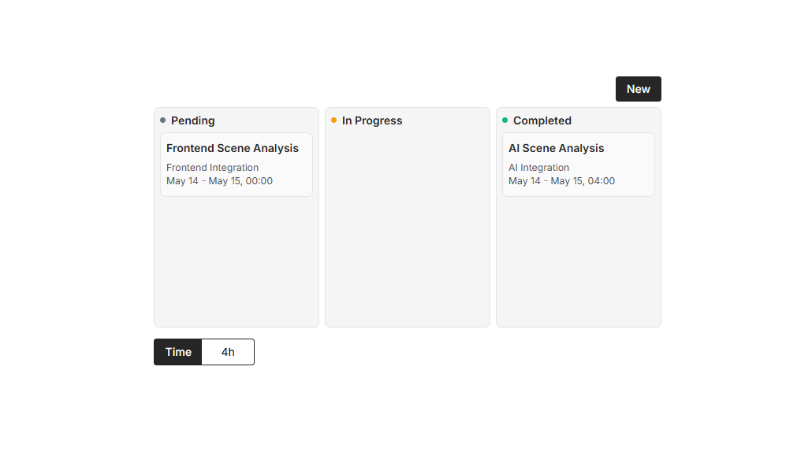

# 📝 Kanban - React + Vite

Este é um projeto de **Kanban** feito com **React + Vite**, com suporte a:

- ✅ Criação e Edição de tarefas
- 📦 Armazenamento persistente com `localStorage`
- 🧲 Drag-and-drop com `@dnd-kit`
- 🧠 Organização por status (Pending, In Progress, Completed)
- ⏱️ Contador de tempo gasto nas tarefas concluídas
- 🌐 Deploy via GitHub Pages

 <!-- opcional, se quiser colocar uma imagem -->

---

## 🚀 Deploy

Acesse o projeto online:  
👉 [https://byruzie.github.io/kanban/](https://byruzie.github.io/kanban/)

---

## 🧰 Tecnologias usadas

- [React](https://react.dev/)
- [Vite](https://vitejs.dev/)
- [@dnd-kit](https://docs.dndkit.com/)
- [TailwindCSS](https://tailwindcss.com/) *(ou classes utilitárias customizadas)*
- `localStorage` para persistência de dados
- `gh-pages` para deploy

---

## 🧠 Aprendizados

- Estado global com React (lifting state up)
- Integração de drag-and-drop com @dnd-kit
- Persistência com `localStorage`
- Deploy de SPA com Vite no GitHub Pages
- Manipulação de datas, formatação e controle de formulário

---

## 🙋‍♂️ Autor

Desenvolvido por Raul Cardoso